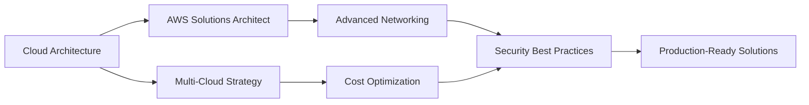

<div align="center">
  
# 👋 Hey there, I'm Kartik Bhapkar

### ☁️ Cloud & DevOps Engineer | Infrastructure Enthusiast | Automation Advocate


[](YOUR_LINKEDIN_URL)
[](mailto:YOUR_EMAIL)
[](YOUR_PORTFOLIO_URL)
[](YOUR_TWITTER_URL)


</div>

---

## 🚀 About Me

```yaml
name: Kartik Bhapkar
role: Cloud & DevOps Engineer
location: India
current_focus: 
  - Building scalable cloud infrastructure
  - Automating deployment pipelines
  - Mastering Kubernetes orchestration
  - Infrastructure as Code (IaC)
learning: 
  - Advanced AWS architecture
  - Terraform & CloudFormation
  - Container orchestration at scale
  - Monitoring & observability
motto: "Automate everything, break things intentionally, learn constantly"
```

🎯 **Mission**: Transform infrastructure into code, eliminate manual toil, and build resilient, self-healing systems

💡 **Philosophy**: *"If you haven't automated it, you haven't finished it"*

🔭 Currently working on building production-grade CI/CD pipelines and cloud-native applications

🌱 Deep diving into **Kubernetes**, **Terraform**, and **GitOps** practices

⚡ Fun fact: I get more excited about a successful infrastructure deployment than most people do about their birthday! 🎂→📦

---

## 🛠️ Technology Arsenal

<details open>
<summary><b>☁️ Cloud Platforms</b></summary>
<br>


**AWS Services**: EC2 • S3 • Lambda • RDS • DynamoDB • VPC • IAM • CloudFormation • ECS • EKS • CloudWatch • Route53 • API Gateway • SNS • SQS

</details>

<details open>
<summary><b>🐳 Containers & Orchestration</b></summary>
<br>


**Expertise**: Container optimization • Multi-stage builds • K8s deployments • Helm charts • Service mesh (Istio)

</details>

<details open>
<summary><b>🔄 CI/CD & Automation</b></summary>
<br>


**Pipelines**: Automated testing • Continuous deployment • Blue-green deployments • Canary releases • GitOps workflows

</details>

<details open>
<summary><b>📜 Infrastructure as Code</b></summary>
<br>


**Skills**: Infrastructure provisioning • Configuration management • State management • Module development

</details>

<details open>
<summary><b>📊 Monitoring & Observability</b></summary>
<br>


**Observability**: Metrics collection • Log aggregation • Distributed tracing • Alerting • Dashboards

</details>

<details open>
<summary><b>🐧 Operating Systems & Scripting</b></summary>
<br>


**System Admin**: User management • Service configuration • Network troubleshooting • Shell scripting • Automation

</details>

<details open>
<summary><b>🔐 Security & Compliance</b></summary>
<br>


**Practices**: Secrets management • Container scanning • SAST/DAST • Compliance automation • Zero-trust architecture

</details>

<details open>
<summary><b>🗄️ Databases & Caching</b></summary>
<br>


</details>

<details open>
<summary><b>🔧 Version Control & Collaboration</b></summary>
<br>


</details>

<details open>
<summary><b>💻 Development & Languages</b></summary>
<br>


</details>

---

## 🏆 Featured Projects

<table>
<tr>
<td width="50%">

### 🚀 [AWS Auto-Scaling Infrastructure](https://github.com/yourusername/project1)
**Production-ready auto-scaling web application on AWS**

- 🏗️ Infrastructure as Code with **Terraform**
- 🔄 CI/CD pipeline with **GitHub Actions**
- 📊 Monitoring with **CloudWatch & Grafana**
- 🔐 Secured with **IAM roles & Security Groups**
- 💰 Cost-optimized with **Auto Scaling Groups**


</td>
<td width="50%">

### 🐳 [Microservices K8s Deployment](https://github.com/yourusername/project2)
**Containerized microservices with Kubernetes orchestration**

- 🎯 Multi-service architecture on **EKS**
- 📦 Container images in **ECR**
- 🔄 **Helm charts** for deployment
- 📈 **Prometheus + Grafana** observability
- 🔧 **ArgoCD** for GitOps


</td>
</tr>

<tr>
<td width="50%">

### ⚡ [Jenkins CI/CD Pipeline](https://github.com/yourusername/project3)
**Automated build, test, and deployment pipeline**

- 🔨 Multi-stage **Jenkins** pipeline
- 🧪 Automated testing with **pytest**
- 🐳 Docker image building & scanning
- 🚀 Automated deployment to **K8s**
- 📧 Slack notifications & alerts


</td>
<td width="50%">

### 🏗️ [Multi-Cloud Terraform Modules](https://github.com/yourusername/project4)
**Reusable IaC modules for AWS, Azure, and GCP**

- 📦 Modular **Terraform** architecture
- ☁️ Multi-cloud support
- 🔄 Automated testing with **Terratest**
- 📚 Comprehensive documentation
- 🏷️ Semantic versioning


</td>
</tr>

<tr>
<td width="50%">

### 📊 [Infrastructure Monitoring Stack](https://github.com/yourusername/project5)
**Complete observability solution**

- 📈 **Prometheus** metrics collection
- 📊 **Grafana** dashboards
- 📝 **ELK Stack** for logs
- 🔔 **AlertManager** for notifications
- 🐳 Fully containerized deployment


</td>
<td width="50%">

### 🔐 [Secure Secrets Management](https://github.com/yourusername/project6)
**Enterprise-grade secrets management solution**

- 🔒 **HashiCorp Vault** integration
- 🔄 Automated secret rotation
- 🔑 Dynamic credentials for databases
- 📦 K8s secrets injection
- 🛡️ Encryption at rest & in transit


</td>
</tr>
</table>

---

## 📈 GitHub Analytics

<div align="center">
  
  
</div>

<div align="center">
  
</div>

<div align="center">
  
</div>

---

## 🎯 Current Focus & Learning Path



### 📚 Currently Mastering:
- ☁️ **AWS Advanced Architectures** - Well-Architected Framework, landing zones
- 🎯 **Kubernetes at Scale** - Multi-cluster management, service mesh
- 🔧 **Advanced Terraform** - Module development, state management, testing
- 📊 **Observability** - Distributed tracing, SLI/SLO/SLA monitoring
- 🔐 **Security** - Zero-trust architecture, compliance automation

### 🎓 Certifications (In Progress):
- [ ] AWS Certified Solutions Architect - Professional
- [ ] Certified Kubernetes Administrator (CKA)
- [ ] HashiCorp Certified: Terraform Associate
- [ ] AWS Certified DevOps Engineer - Professional

---

## 📝 Latest Blog Posts

<!-- BLOG-POST-LIST:START -->
- 🚀 [Building a Production-Ready EKS Cluster with Terraform](https://yourblog.com/post1)
- 🔄 [Implementing GitOps with ArgoCD and Kubernetes](https://yourblog.com/post2)
- 📊 [Complete Observability Stack with Prometheus & Grafana](https://yourblog.com/post3)
- 🐳 [Docker Multi-Stage Builds: Best Practices](https://yourblog.com/post4)
- ⚡ [Optimizing CI/CD Pipelines: From 20 mins to 5 mins](https://yourblog.com/post5)
<!-- BLOG-POST-LIST:END -->

➡️ [Read more on my blog...](https://yourblog.com)

---

## 🤝 Let's Connect!

<div align="center">

I'm always interested in collaborating on **DevOps projects**, discussing **cloud architecture**, or helping with **infrastructure automation**. Feel free to reach out!

[](YOUR_LINKEDIN_URL)
[](YOUR_TWITTER_URL)
[](mailto:YOUR_EMAIL)
[](YOUR_BLOG_URL)

### 💬 Ask me about:
**AWS** • **Kubernetes** • **Terraform** • **CI/CD** • **Docker** • **Linux** • **DevOps Best Practices**

</div>

---

## 💡 DevOps Philosophy

> *"The best infrastructure is the one you never have to touch. Automate, monitor, and sleep peacefully."*

```python
class DevOpsEngineer:
    def __init__(self):
        self.name = "Kartik Bhapkar"
        self.role = "Cloud & DevOps Engineer"
        self.skills = {
            "cloud": ["AWS", "Azure", "GCP"],
            "containers": ["Docker", "Kubernetes", "Helm"],
            "iac": ["Terraform", "CloudFormation", "Ansible"],
            "cicd": ["Jenkins", "GitHub Actions", "ArgoCD"],
            "monitoring": ["Prometheus", "Grafana", "ELK"],
            "scripting": ["Python", "Bash", "PowerShell"]
        }
    
    def daily_routine(self):
        activities = [
            "Automate manual processes",
            "Optimize cloud costs",
            "Improve deployment pipelines",
            "Monitor system health",
            "Learn new technologies",
            "Break things (in staging) intentionally"
        ]
        return activities
    
    def life_motto(self):
        return "If it can be automated, it should be automated!"
```

---

<div align="center">

### 🌟 "Automate Everything, Monitor Always, Deploy Fearlessly" 🌟


**⭐ Star my repositories if you find them useful! ⭐**


---

*Last Updated: January 2026*

</div>
